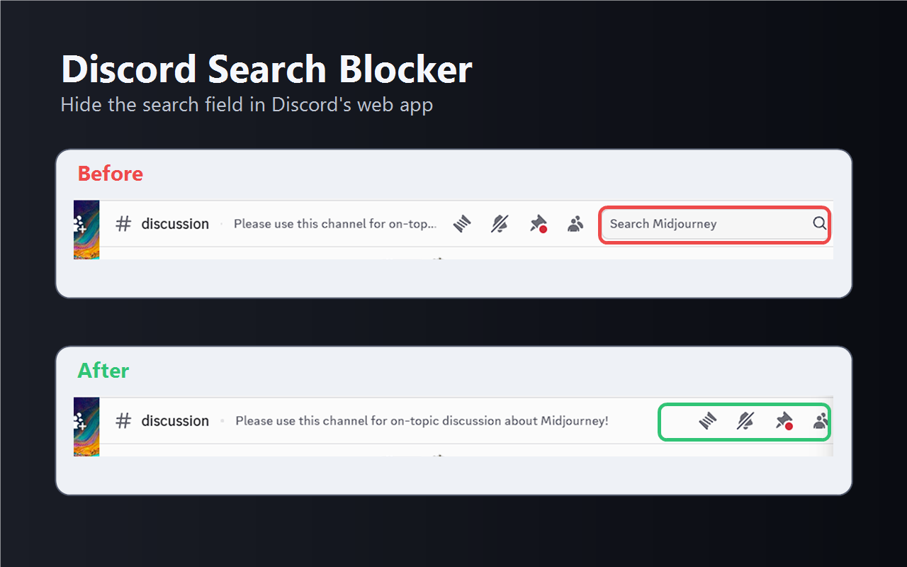
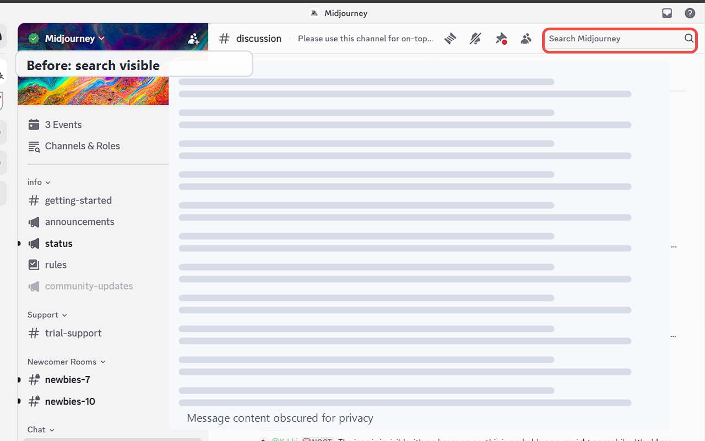
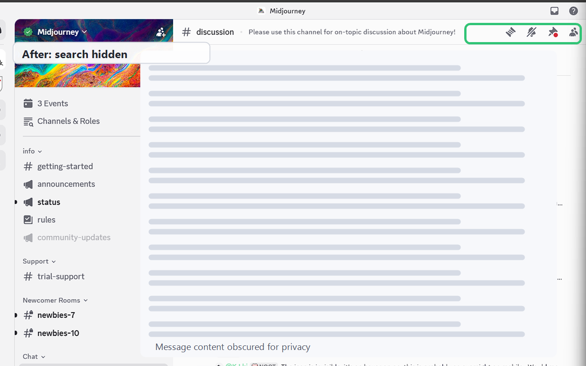
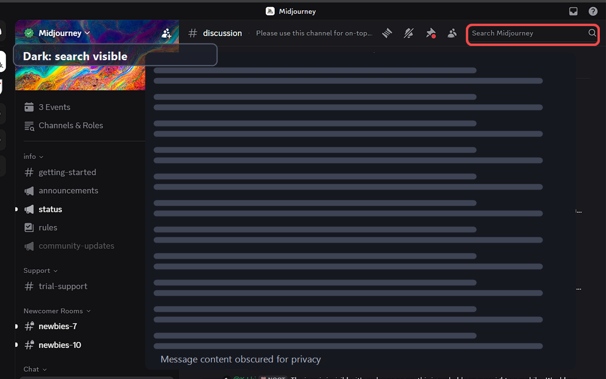
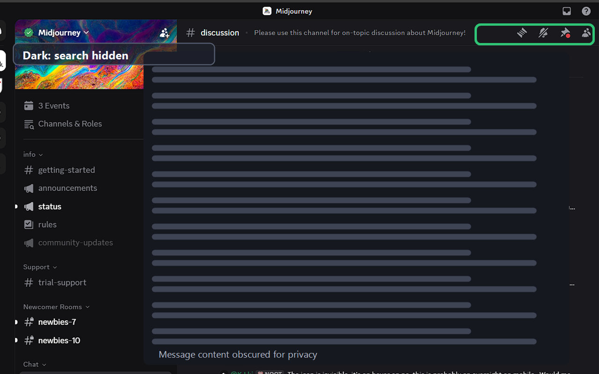

# Discord Search Blocker

[](https://chromewebstore.google.com/detail/discord-search-blocker/nkmoecimnipoeijdcbohpebjpofmhegb)
[](CHANGELOG.md)
[](LICENSE.txt)
[](#privacy)

A tiny Chrome extension that hides Discord's in-channel search field on `discord.com`.



## Why

Discord lets you mute, block, or avoid channels, but the search field can still surface messages from places you are trying not to revisit. Discord Search Blocker removes that search entry point from the web UI.

This started as a personal commitment tool: not just hiding a distracting element, but making it harder to casually restore.

## Install

Install from the Chrome Web Store:

[Discord Search Blocker on the Chrome Web Store](https://chromewebstore.google.com/detail/discord-search-blocker/nkmoecimnipoeijdcbohpebjpofmhegb)

For local development or manual install:

1. Download or clone this repository.
2. Open `chrome://extensions`.
3. Enable **Developer mode**.
4. Click **Load unpacked**.
5. Select this extension folder.

For stricter blocking, install it through Chrome managed extension or force-install policies. The extension itself does not require special configuration.

## Features

- Hides Discord's in-channel search field.
- Runs only on `discord.com`.
- Works in light and dark Discord themes.
- Uses Chrome's built-in localization system with 50 locales.
- Does not read messages, collect data, or send analytics.

## How It Works

The content script watches Discord's web UI and hides search-related containers that include Discord's editable search input.

It does not:

- read messages
- send data anywhere
- modify your Discord account
- block Discord's backend search API directly

It only changes the visible web UI in your browser.

## Screenshots









## Permissions

The extension uses a content script on:

```json
"*://discord.com/channels/*"
```

This is needed so it can run inside Discord channel pages and hide the search field when Discord renders it.

## Project Structure

- `manifest.json` - Chrome extension manifest
- `src/content.js` - logic that hides the Discord search field
- `_locales/` - localized extension name and description strings
- `assets/icons/` - extension icons
- `assets/store/` - Chrome Web Store promotional images and screenshots
- `STORE_LISTING.md` - Chrome Web Store listing index
- `store-listing/` - Chrome Web Store description copy split by locale
- `STORE_JUSTIFICATIONS.md` - Chrome Web Store single-purpose and host-permission justifications
- `tools/generate-assets.ps1` - reproducible icon and promotional image generator
- `tools/generate-store-screenshots.ps1` - reproducible store screenshot generator
- `tools/package.ps1` - reproducible Chrome Web Store package builder
- `dist/` - packaged extension builds
- `.webstoreignore` - files to exclude when creating a Chrome Web Store upload package
- `LICENSE.txt` - GPL license text

## Development

After making changes, reload the extension from `chrome://extensions` and refresh Discord.

Create a Chrome Web Store upload package:

```powershell
powershell -NoProfile -ExecutionPolicy Bypass -File tools\package.ps1
```

The current package is:

```text
dist/discord-search-blocker-1.2.0.zip
```

## Localization

The extension uses Chrome's built-in localization system and includes manifest text for 50 locales. The product name stays consistent as "Discord Search Blocker"; the extension description is translated per locale in `_locales/<locale>/messages.json`.

Chrome Web Store listing copy is maintained separately in `store-listing/`, with `STORE_LISTING.md` as the index.

## Privacy

Discord Search Blocker does not collect, store, or transmit any data. It has no analytics, no tracking, and no remote server.

## Support

If this extension saves you time and you want to support its development:

[](https://buymeacoffee.com/molodchyk)
[](https://www.patreon.com/OMolodchyk)

## License

This project is licensed under the GNU General Public License v3.0 or later. See `LICENSE.txt` for details.
